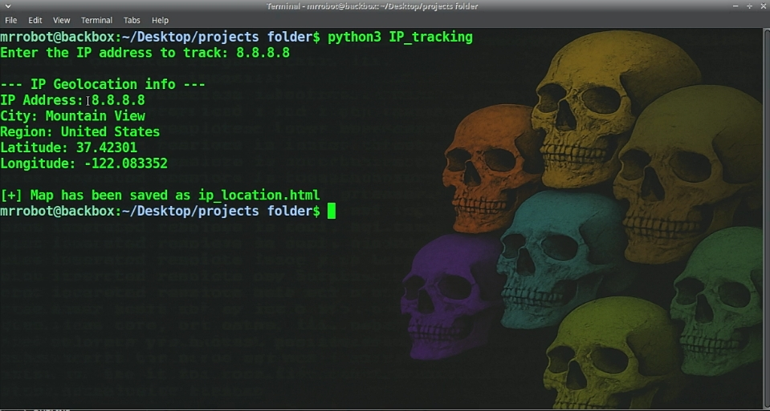

# 🛰️ IP Address Tracker using Python

> 🎯 Track the **real-world location** of any public IP address using Python  
> 🚨 For **educational purposes only** — learn how geolocation works and how to protect yourself!

---



## 📌 As Seen On YouTube

📺 **Watch Full Tutorial Video**  
👉 [Click Here to Watch](https://youtu.be/y69ahzFg5FE?si=7-zMIzhuxYiHJN5W)

---

## 🧠 What This Project Does

This Python tool allows you to:

- 📍 Get IP geolocation info (City, Region, Country, Coordinates)
- 🗺️ Generate an interactive map of the IP location
- 🧠 Learn how IP tracking works so you can defend yourself

It uses:

- `ipapi.co` (free IP geolocation API)
- `requests` for API calls
- `folium` to generate a live map

---

## 🛠️ Requirements

You must have **Python 3** installed.  
Then install dependencies using:

```bash
pip install -r requirements.txt
```

Or manually:

```bash
pip install requests folium
```

---

## 🚀 How to Use

1. **Clone the repository:**

```bash
git clone https://github.com/ACW360/IP_Tracker.git
cd IP_Tracker
```

2. **Run the script:**

```bash
python ip_tracker.py
```

3. **Enter the target IP address** when prompted.

4. ✅ The script will display geolocation info and generate a map as `ip_location_map.html`.

---

## 📂 Files Included

| File | Description |
|------|-------------|
| `ip_tracker.py` | Main Python script |
| `requirements.txt` | Required Python libraries |
| `README.md` | Project documentation |
| `ip_location_map.html` | Map file (generated) |
| `screenshot.png` | (Optional) Screenshot preview |

---

## 💡 Sample Output

```
--- IP Geolocation Info ---
IP Address: 8.8.8.8
City: Mountain View
Region: California
Country: United States
Latitude: 37.386
Longitude: -122.084

[+] Map has been saved as ip_location_map.html
```

---

## 🛡️ How to Protect Yourself from IP Tracking

- 🔒 Use a VPN
- 🛑 Don’t click on suspicious links
- 🔐 Avoid insecure websites
- 🧅 Use the Tor Browser for anonymity

---

## ⚠️ Disclaimer

> This tool is for **educational and ethical purposes only**.  
> Do not use it to track people without their **explicit consent**.  
> The developer is **not responsible** for any misuse.

---

## ⭐ Support This Project

If this helped you, please **give it a ⭐ on GitHub** and **share the YouTube video** to help others learn!

---

## 🙌 Credits

Created with ❤️ by [ACW360](https://github.com/ACW360)
